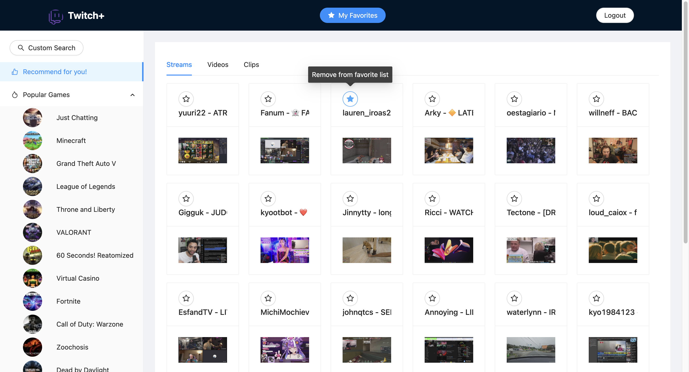
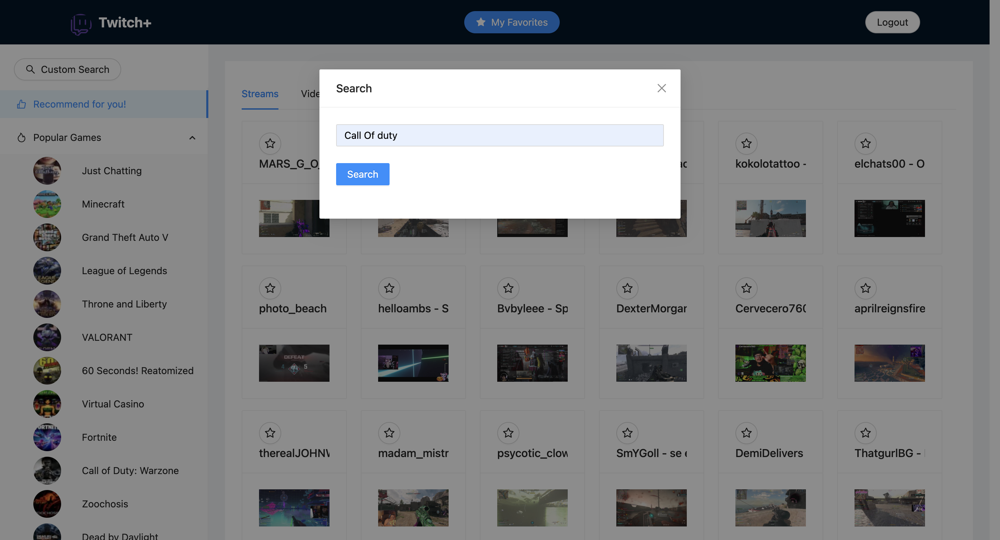
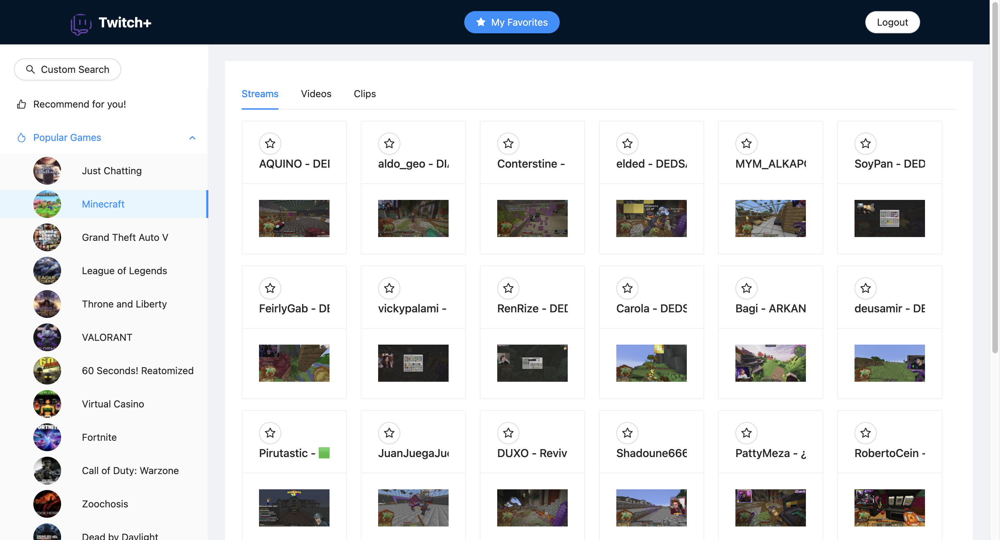
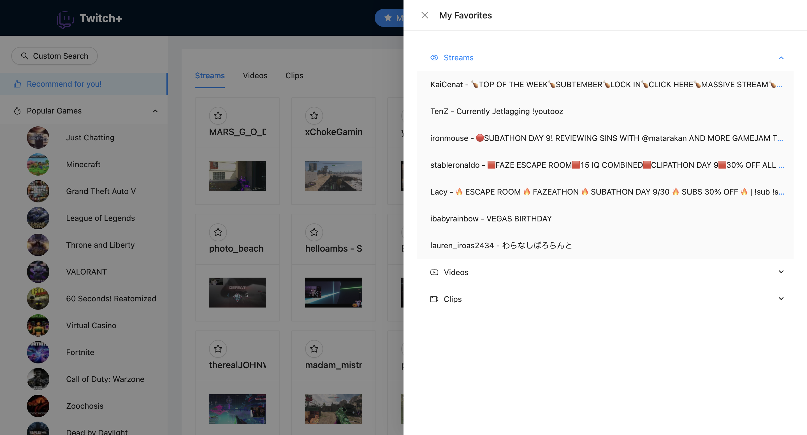

# Twitch-plus

Twitch-plus is a fullstack project designed to interact with Twitch's API, providing functionalities such as user registration, video recommendations, and managing favorite items based on Spring Boot and React.

## Table of Contents

- [Prerequisite](#prerequisite)
- [Deploy](#deploy)
- [Features](#features)
- [Gallary](#gallary)
- [Architecture](#architecture)
- [Contributing](#contributing)
- [Resources](#resources)

## Prerequisite

1. You must have a Twitch developer `client-id` and `client-secret` to interact with Twitch API. If you don't know how to get them, follow the steps below:
	* You must have a Twitch account with a verified email
	* Log in to the [developer console](https://dev.twitch.tv/console) using your Twitch account
	* Select the **Applications** tab on the developer console and then click **Register Your Application** 
	* Make sure the application name is unique, or the registion will fail silently
	* For the OAuth redirect URL, use `http://localhost` because we are using `client_credentials` for authentication
	* For the category, use `Website Integration`
	* Then you can register an app and get the credentials. Make sure you record the `client-secret` in your memo because it won't show again.

2. Some configs you need to make in the `backend` project
 	* Fill in your `client-id` and `client-secret` in the `resources/application.yml` file. I've marked the placeholder as `<YOUR-CLIENT-ID>` and `<YOUR-CLIENT-SECRET>`
  * Fill in your MySQL root password in the `resources/application.yml` file. I've marked the placeholder as `<YOUR-MYSQL-ROOT-PASSWORD>`
  * Execute the `resources/sql/database-init.sql` file to init your database and tables
3. Try executing the `BackendApplication` directly to see if it works.

## Deploy

The `backend` project implements the backend service, while the `frontend` project implements the frontend UI. They should be deployed separately.

1. In the `backend` project, install dependencies through Gradle, then start the application from `BackendApplication` class. The backend service will run in `localhost:8080`.
2. In the `frontend` project, start the frontend by executing `npm run start` in your CLI. The frontend will run in `localhost:3000`.
3. Access `localhost:3000`, then you should be able to see the frontend UI.

## Features

- **User Management**: Register and manage users.
- **Item Recommendations**: Retrieve recommended items based on user preferences.
- **Favorites Management**: Add, remove, and list favorite items.
- **Integration with Twitch API**: Fetch games, videos, clips, and streams.

## Gallary

**Recommendations**

**Custom Search**

**Top Games**

**Favorites**

## Architecture

The backend service is built using Spring Boot and follows a layered architecture:

- **Controllers**: Handle HTTP requests and responses.
	- `UserController`: Manages user-related endpoints.
	- `GameController`: Fetches game data from Twitch.
	- `ItemController`: Searches for items based on game ID.
	- `FavoriteController`: Manages favorite items for users.

- **Services**: Contain business logic.
	- `UserService`: Handles user operations.
	- `ItemService`: Retrieves items from Twitch.
	- `FavoriteService`: Manages favorite items.

- **Data Access**: Interacts with the database.
	- `UserRepository`: CRUD operations for users.
	- `FavoriteRecordRepository`: Manages favorite records.
	- `ItemRepository`: Manages item records.

- **Models**: Represent data structures.
	- `UserEntity`: Represents a user in the database.
	- `TypeGroupedItemList`: Groups items by type.

- **External Models**: Represent data from external APIs.
	- `GameResponse`, `VideoResponse`: Handle responses from Twitch API.

## Contributing

Contributions are welcome! Please fork the repository and submit a pull request.

## Resources

* [Registering Your Application](https://dev.twitch.tv/docs/authentication/register-app/)
* [Twitch developers](https://dev.twitch.tv/)
	* [get-clips API](https://dev.twitch.tv/docs/api/reference/#get-clips)
	* [get-games API](https://dev.twitch.tv/docs/api/reference/#get-games)
	* [get-streams API](https://dev.twitch.tv/docs/api/reference/#get-streams)
	* [get-users API](https://dev.twitch.tv/docs/api/reference/#get-users)